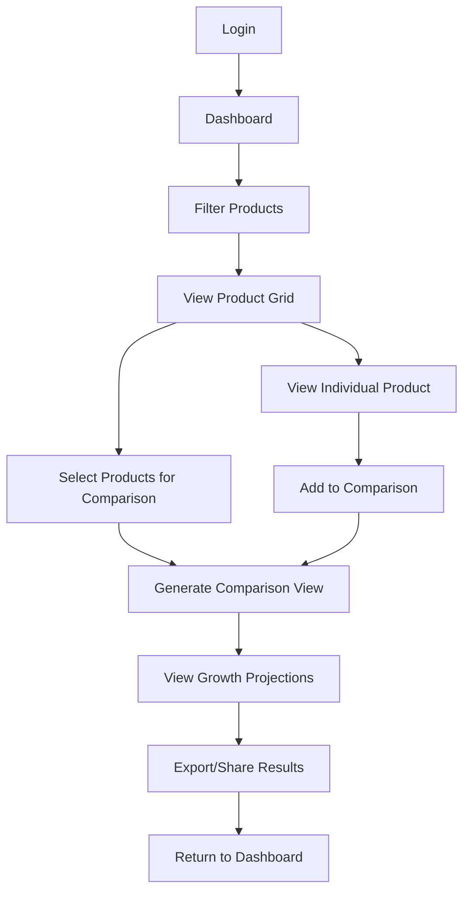
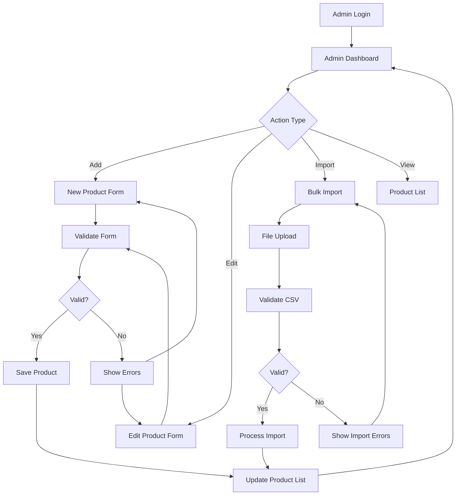

# Investment Product Sales Tool - UI Implementation Plan

## 1. Executive Summary

This UI Implementation Plan provides detailed specifications for building the frontend interface of the Investment Product Sales Tool. The plan covers component architecture, user workflows, responsive design patterns, and implementation priorities to deliver an intuitive, accessible, and performant user experience.

## 2. Design System Foundation

### 2.1 Design Tokens
```typescript
// Color Palette
const colors = {
  primary: {
    50: '#f0f9ff',
    500: '#3b82f6',
    600: '#2563eb',
    700: '#1d4ed8',
    900: '#1e3a8a'
  },
  secondary: {
    50: '#f8fafc',
    500: '#64748b',
    600: '#475569',
    700: '#334155'
  },
  success: '#10b981',
  warning: '#f59e0b',
  error: '#ef4444',
  neutral: {
    50: '#f8fafc',
    100: '#f1f5f9',
    200: '#e2e8f0',
    500: '#64748b',
    700: '#334155',
    900: '#0f172a'
  }
}

// Typography Scale
const typography = {
  h1: 'text-3xl font-bold',
  h2: 'text-2xl font-semibold',
  h3: 'text-xl font-semibold',
  h4: 'text-lg font-medium',
  body: 'text-base',
  small: 'text-sm',
  xs: 'text-xs'
}

// Spacing Scale
const spacing = {
  xs: '0.5rem',
  sm: '0.75rem',
  md: '1rem',
  lg: '1.5rem',
  xl: '2rem',
  '2xl': '3rem'
}
```

### 2.2 Component Library Structure
```
src/
├── components/
│   ├── ui/           # Base UI components
│   ├── forms/        # Form components
│   ├── layout/       # Layout components
│   ├── data-display/ # Data visualization components
│   └── feedback/     # Notifications, alerts, etc.
├── pages/            # Page components
├── hooks/            # Custom React hooks
├── utils/            # Utility functions
└── types/            # TypeScript definitions
```

## 3. Core UI Components

### 3.1 Base Components

#### Button Component
```typescript
interface ButtonProps {
  variant: 'primary' | 'secondary' | 'outline' | 'ghost';
  size: 'sm' | 'md' | 'lg';
  disabled?: boolean;
  loading?: boolean;
  icon?: React.ReactNode;
  onClick?: () => void;
  children: React.ReactNode;
}
```

#### Input Component
```typescript
interface InputProps {
  type: 'text' | 'email' | 'password' | 'number' | 'search';
  label: string;
  placeholder?: string;
  value: string;
  onChange: (value: string) => void;
  error?: string;
  disabled?: boolean;
  required?: boolean;
  helpText?: string;
}
```

#### Card Component
```typescript
interface CardProps {
  title?: string;
  subtitle?: string;
  actions?: React.ReactNode;
  children: React.ReactNode;
  className?: string;
}
```

### 3.2 Data Display Components

#### DataTable Component
```typescript
interface DataTableProps<T> {
  data: T[];
  columns: Column<T>[];
  loading?: boolean;
  pagination?: PaginationProps;
  sorting?: SortingProps;
  filtering?: FilteringProps;
  selection?: SelectionProps;
  actions?: ActionProps<T>;
}
```

#### ProductCard Component
```typescript
interface ProductCardProps {
  product: InvestmentProduct;
  onSelect?: (product: InvestmentProduct) => void;
  onCompare?: (product: InvestmentProduct) => void;
  selected?: boolean;
  showProjections?: boolean;
}
```

#### GrowthChart Component
```typescript
interface GrowthChartProps {
  data: GrowthProjection[];
  principal: number;
  timeHorizon: number;
  showComparison?: boolean;
  products?: InvestmentProduct[];
}
```

### 3.3 Form Components

#### ProductForm Component
```typescript
interface ProductFormProps {
  product?: InvestmentProduct;
  onSubmit: (product: InvestmentProduct) => void;
  onCancel: () => void;
  loading?: boolean;
  errors?: ValidationErrors;
}
```

#### FilterPanel Component
```typescript
interface FilterPanelProps {
  filters: FilterConfig[];
  values: FilterValues;
  onChange: (filters: FilterValues) => void;
  onReset: () => void;
}
```

## 4. Page Layouts and Workflows

### 4.1 Sales Interface Layout

#### Main Sales Dashboard
```
┌─────────────────────────────────────────────────────────────┐
│ Header: Logo | Navigation | User Menu | Notifications        │
├─────────────────────────────────────────────────────────────┤
│ ┌─────────────────┐ ┌─────────────────────────────────────┐ │
│ │ Filter Panel    │ │ Product Grid/List View              │ │
│ │                 │ │                                     │ │
│ │ • Product Type  │ │ ┌─────────┐ ┌─────────┐ ┌─────────┐ │ │
│ │ • Rate Range    │ │ │Product 1│ │Product 2│ │Product 3│ │ │
│ │ • Term Length   │ │ │         │ │         │ │         │ │ │
│ │ • Min Investment│ │ │ Rate    │ │ Rate    │ │ Rate    │ │ │
│ │                 │ │ │ Terms   │ │ Terms   │ │ Terms   │ │ │
│ │ [Apply Filters] │ │ │ [Select]│ │ [Select]│ │ [Select]│ │ │
│ │ [Reset]         │ │ │[Compare]│ │[Compare]│ │[Compare]│ │ │
│ └─────────────────┘ │ └─────────┘ └─────────┘ └─────────┘ │ │
│                     │                                     │ │
│                     │ [Show Comparison] [Generate Report] │ │
│                     └─────────────────────────────────────┘ │
├─────────────────────────────────────────────────────────────┤
│ Footer: Links | Version | Status                            │
└─────────────────────────────────────────────────────────────┘
```

#### Product Comparison View
```
┌─────────────────────────────────────────────────────────────┐
│ Comparison Dashboard                                        │
├─────────────────────────────────────────────────────────────┤
│ ┌─────────────┐ ┌─────────────┐ ┌─────────────┐           │
│ │ Product A   │ │ Product B   │ │ Product C   │           │
│ │ CUSIP: XXX  │ │ CUSIP: YYY  │ │ CUSIP: ZZZ  │           │
│ │ Rate: 4.5%  │ │ Rate: 4.2%  │ │ Rate: 4.8%  │           │
│ │ Term: 5yrs  │ │ Term: 3yrs  │ │ Term: 7yrs  │           │
│ │ Min: $10K   │ │ Min: $5K    │ │ Min: $25K   │           │
│ └─────────────┘ └─────────────┘ └─────────────┘           │
├─────────────────────────────────────────────────────────────┤
│ Growth Projections Chart                                    │
│ ┌─────────────────────────────────────────────────────────┐ │
│ │     $20K ┌─────────────────────────────────────────────┐ │ │
│ │          │                                       ╱     │ │ │
│ │     $15K │                                 ╱           │ │ │
│ │          │                           ╱                 │ │ │
│ │     $10K │─────────────────────╱                       │ │ │
│ │          └─────────────────────────────────────────────┘ │ │
│ │           Year 1    Year 3    Year 5    Year 7         │ │
│ └─────────────────────────────────────────────────────────┘ │
├─────────────────────────────────────────────────────────────┤
│ [Export PDF] [Email Customer] [Print] [Save Comparison]    │
└─────────────────────────────────────────────────────────────┘
```

### 4.2 Administrative Interface Layout

#### Product Management Dashboard
```
┌─────────────────────────────────────────────────────────────┐
│ Admin Dashboard                                             │
├─────────────────────────────────────────────────────────────┤
│ ┌─────────────────┐ ┌─────────────────────────────────────┐ │
│ │ Quick Actions   │ │ Product Management                  │ │
│ │                 │ │                                     │ │
│ │ [Add Product]   │ │ Search: [________________] [Filter] │ │
│ │ [Import CSV]    │ │                                     │ │
│ │ [Export Data]   │ │ ┌─────────────────────────────────┐ │ │
│ │ [View Audit]    │ │ │ Product List Table              │ │ │
│ │                 │ │ │ CUSIP | Name | Rate | Status    │ │ │
│ │ System Status   │ │ │ ──────────────────────────────  │ │ │
│ │ 🟢 API Online   │ │ │ XXX   | Ann1 | 4.5% | Active   │ │ │
│ │ 🟢 DB Connected │ │ │ YYY   | CD1  | 4.2% | Draft    │ │ │
│ │ 🟢 Auth Service │ │ │ ZZZ   | Ann2 | 4.8% | Expired  │ │ │
│ └─────────────────┘ │ │ [Edit] [Delete] [Duplicate]     │ │ │
│                     │ └─────────────────────────────────┘ │ │
│                     │ Pagination: [1] [2] [3] ... [10]   │ │
│                     └─────────────────────────────────────┘ │
└─────────────────────────────────────────────────────────────┘
```

#### Product Form Modal
```
┌─────────────────────────────────────────────────────────────┐
│ ✕ Add/Edit Product                                          │
├─────────────────────────────────────────────────────────────┤
│ ┌─────────────────┐ ┌─────────────────────────────────────┐ │
│ │ Basic Info      │ │ Rate Information                    │ │
│ │                 │ │                                     │ │
│ │ CUSIP: [______] │ │ Base Rate: [____] %                │ │
│ │ Name:  [______] │ │ Bonus Rate: [___] %                │ │
│ │ Type:  [▼ Ann ] │ │ Return of Premium: [✓]             │ │
│ │ Category:[____] │ │ Compounding: [▼ Annual]            │ │
│ │                 │ │                                     │ │
│ │ Term Information│ │ Availability                        │ │
│ │ Length: [__] yrs│ │ Start Date: [MM/DD/YYYY]           │ │
│ │ Min Invest: $[_]│ │ End Date: [MM/DD/YYYY]             │ │
│ │ Max Invest: $[_]│ │ Status: [▼ Draft]                  │ │
│ └─────────────────┘ └─────────────────────────────────────┘ │
├─────────────────────────────────────────────────────────────┤
│ Description:                                                │
│ ┌─────────────────────────────────────────────────────────┐ │
│ │ [Rich text editor for product description]              │ │
│ └─────────────────────────────────────────────────────────┘ │
├─────────────────────────────────────────────────────────────┤
│                           [Cancel] [Save Draft] [Activate] │
└─────────────────────────────────────────────────────────────┘
```

## 5. User Experience Workflows

### 5.1 Banker Product Comparison Workflow



### 5.2 Admin Product Management Workflow



## 6. Responsive Design Specifications

### 6.1 Breakpoint Strategy
```typescript
const breakpoints = {
  mobile: '320px',
  tablet: '768px',
  desktop: '1024px',
  wide: '1440px'
}
```

### 6.2 Mobile Layout Adaptations

#### Sales Interface Mobile
```
┌─────────────────────┐
│ ☰ Investment Tool   │
├─────────────────────┤
│ [🔍 Search]         │
│ [🎚️ Filters]        │
├─────────────────────┤
│ Product 1           │
│ Rate: 4.5%          │
│ Term: 5 years       │
│ [Select] [Compare]  │
├─────────────────────┤
│ Product 2           │
│ Rate: 4.2%          │
│ Term: 3 years       │
│ [Select] [Compare]  │
├─────────────────────┤
│ [View Comparison]   │
│ [Generate Report]   │
└─────────────────────┘
```

#### Admin Interface Mobile
```
┌─────────────────────┐
│ ☰ Admin Panel      │
├─────────────────────┤
│ [+ Add Product]     │
│ [📁 Import]         │
│ [📊 Reports]        │
├─────────────────────┤
│ Product XXX         │
│ Annuity | 4.5%      │
│ Status: Active      │
│ [Edit] [Delete]     │
├─────────────────────┤
│ Product YYY         │
│ CD | 4.2%           │
│ Status: Draft       │
│ [Edit] [Delete]     │
└─────────────────────┘
```

## 7. Accessibility Implementation

### 7.1 WCAG 2.1 AA Compliance Checklist

#### Navigation
- [ ] Skip links for keyboard navigation
- [ ] Focus indicators visible on all interactive elements
- [ ] Logical tab order throughout application
- [ ] ARIA landmarks for main content areas

#### Forms
- [ ] All form inputs have associated labels
- [ ] Error messages clearly associated with fields
- [ ] Required fields indicated to screen readers
- [ ] Form validation messages are announced

#### Data Tables
- [ ] Table headers properly associated with data cells
- [ ] Complex tables include scope attributes
- [ ] Sorting controls are keyboard accessible
- [ ] Table summaries provided for screen readers

#### Interactive Elements
- [ ] Buttons have descriptive text or ARIA labels
- [ ] Links have meaningful text
- [ ] Interactive elements have minimum 44px touch targets
- [ ] Disabled states communicated to assistive technology

### 7.2 Accessibility Components

#### ScreenReaderOnly Component
```typescript
const ScreenReaderOnly: React.FC<{ children: React.ReactNode }> = ({ children }) => (
  <span className="sr-only">{children}</span>
);
```

#### FocusManager Component
```typescript
const FocusManager: React.FC<{
  children: React.ReactNode;
  autoFocus?: boolean;
  restoreFocus?: boolean;
}> = ({ children, autoFocus, restoreFocus }) => {
  // Implementation for focus management
};
```

## 8. Performance Optimization

### 8.1 Code Splitting Strategy
```typescript
// Route-based splitting
const SalesDashboard = lazy(() => import('./pages/SalesDashboard'));
const AdminDashboard = lazy(() => import('./pages/AdminDashboard'));
const ProductComparison = lazy(() => import('./pages/ProductComparison'));

// Component-based splitting
const DataTable = lazy(() => import('./components/DataTable'));
const GrowthChart = lazy(() => import('./components/GrowthChart'));
```

### 8.2 Image Optimization
```typescript
// Lazy loading implementation
const LazyImage: React.FC<{
  src: string;
  alt: string;
  className?: string;
}> = ({ src, alt, className }) => {
  return (
    
  );
};
```

### 8.3 Caching Strategy
```typescript
// Query caching with React Query
const useProducts = () => {
  return useQuery({
    queryKey: ['products'],
    queryFn: fetchProducts,
    staleTime: 5 * 60 * 1000, // 5 minutes
    cacheTime: 10 * 60 * 1000, // 10 minutes
  });
};
```

## 9. Error Handling and Loading States

### 9.1 Error Boundary Implementation
```typescript
interface ErrorBoundaryState {
  hasError: boolean;
  error?: Error;
}

class ErrorBoundary extends React.Component<
  React.PropsWithChildren<{}>,
  ErrorBoundaryState
> {
  constructor(props: React.PropsWithChildren<{}>) {
    super(props);
    this.state = { hasError: false };
  }

  static getDerivedStateFromError(error: Error): ErrorBoundaryState {
    return { hasError: true, error };
  }

  componentDidCatch(error: Error, errorInfo: React.ErrorInfo) {
    console.error('Error boundary caught an error:', error, errorInfo);
  }

  render() {
    if (this.state.hasError) {
      return <ErrorFallback error={this.state.error} />;
    }

    return this.props.children;
  }
}
```

### 9.2 Loading State Components
```typescript
const LoadingSpinner: React.FC<{
  size?: 'sm' | 'md' | 'lg';
  text?: string;
}> = ({ size = 'md', text = 'Loading...' }) => (
  <div className="flex items-center justify-center">
    <div className={`animate-spin rounded-full border-b-2 border-primary-500 ${sizeClasses[size]}`} />
    {text && <span className="ml-2 text-gray-600">{text}</span>}
  </div>
);

const SkeletonLoader: React.FC<{
  rows?: number;
  columns?: number;
}> = ({ rows = 3, columns = 4 }) => (
  <div className="space-y-2">
    {Array.from({ length: rows }).map((_, i) => (
      <div key={i} className="flex space-x-2">
        {Array.from({ length: columns }).map((_, j) => (
          <div key={j} className="h-4 bg-gray-200 rounded animate-pulse flex-1" />
        ))}
      </div>
    ))}
  </div>
);
```

## 10. Testing Strategy

### 10.1 Component Testing
```typescript
// Example test for ProductCard component
describe('ProductCard', () => {
  const mockProduct = {
    cusip: 'TEST123',
    name: 'Test Annuity',
    rate: 4.5,
    term: 5,
    minInvestment: 10000,
    status: 'active'
  };

  it('renders product information correctly', () => {
    render(<ProductCard product={mockProduct} />);
    
    expect(screen.getByText('Test Annuity')).toBeInTheDocument();
    expect(screen.getByText('4.5%')).toBeInTheDocument();
    expect(screen.getByText('5 years')).toBeInTheDocument();
  });

  it('calls onSelect when select button is clicked', () => {
    const mockOnSelect = jest.fn();
    render(<ProductCard product={mockProduct} onSelect={mockOnSelect} />);
    
    fireEvent.click(screen.getByText('Select'));
    expect(mockOnSelect).toHaveBeenCalledWith(mockProduct);
  });
});
```

### 10.2 Accessibility Testing
```typescript
// Accessibility testing with jest-axe
describe('Accessibility', () => {
  it('should not have any accessibility violations', async () => {
    const { container } = render(<SalesDashboard />);
    const results = await axe(container);
    expect(results).toHaveNoViolations();
  });
});
```

### 10.3 Integration Testing
```typescript
// Integration test for product comparison workflow
describe('Product Comparison Workflow', () => {
  it('allows user to compare multiple products', async () => {
    render(<App />);
    
    // Select first product
    fireEvent.click(screen.getByTestId('product-1-select'));
    
    // Select second product
    fireEvent.click(screen.getByTestId('product-2-select'));
    
    // Open comparison view
    fireEvent.click(screen.getByText('View Comparison'));
    
    // Verify comparison view displays
    expect(screen.getByText('Product Comparison')).toBeInTheDocument();
    expect(screen.getByTestId('growth-chart')).toBeInTheDocument();
  });
});
```

## 11. Implementation Timeline

### Phase 1: Foundation Components (Weeks 1-2)
- Design system setup
- Base UI components (Button, Input, Card)
- Layout components (Header, Footer, Sidebar)
- Authentication components
- Error boundaries and loading states

### Phase 2: Sales Interface (Weeks 3-5)
- Product display components
- Filter and search functionality
- Product comparison interface
- Growth projection charts
- Export/print functionality

### Phase 3: Admin Interface (Weeks 6-8)
- Product management forms
- Data table with CRUD operations
- Bulk import/export functionality
- Audit trail interface
- User management components

### Phase 4: Polish and Optimization (Weeks 9-10)
- Performance optimizations
- Accessibility improvements
- Mobile responsiveness
- Error handling enhancements
- Testing and bug fixes

## 12. Quality Assurance Checklist

### 12.1 Functional Testing
- [ ] All user workflows complete successfully
- [ ] Form validation works correctly
- [ ] Data displays accurately
- [ ] Export/import functions work
- [ ] Authentication flows properly

### 12.2 Performance Testing
- [ ] Initial page load under 3 seconds
- [ ] Smooth animations and transitions
- [ ] No memory leaks during navigation
- [ ] Efficient data fetching and caching
- [ ] Images optimized and lazy-loaded

### 12.3 Security Testing
- [ ] Input sanitization implemented
- [ ] XSS protection in place
- [ ] CSRF tokens implemented
- [ ] Authentication tokens secured
- [ ] API endpoints properly protected

### 12.4 Accessibility Testing
- [ ] WCAG 2.1 AA compliance verified
- [ ] Screen reader compatibility tested
- [ ] Keyboard navigation functional
- [ ] Color contrast ratios meet standards
- [ ] Focus indicators visible

### 12.5 Cross-Browser Testing
- [ ] Chrome (latest 2 versions)
- [ ] Firefox (latest 2 versions)
- [ ] Safari (latest 2 versions)
- [ ] Edge (latest 2 versions)
- [ ] Mobile browsers (iOS Safari, Chrome Mobile)

## 13. Deployment and Monitoring

### 13.1 Build Configuration
```typescript
// vite.config.ts
export default defineConfig({
  plugins: [react()],
  build: {
    rollupOptions: {
      output: {
        manualChunks: {
          vendor: ['react', 'react-dom'],
          charts: ['recharts', 'd3'],
          utils: ['lodash', 'date-fns']
        }
      }
    }
  },
  optimizeDeps: {
    include: ['react', 'react-dom', 'recharts']
  }
});
```

### 13.2 Performance Monitoring
```typescript
// Performance monitoring setup
const performanceObserver = new PerformanceObserver((list) => {
  list.getEntries().forEach((entry) => {
    if (entry.entryType === 'navigation') {
      console.log('Page load time:', entry.duration);
    }
  });
});

performanceObserver.observe({ entryTypes: ['navigation'] });
```

### 13.3 Error Monitoring
```typescript
// Error monitoring integration
window.addEventListener('error', (event) => {
  // Log error to monitoring service
  console.error('Global error:', event.error);
});

window.addEventListener('unhandledrejection', (event) => {
  // Log unhandled promise rejection
  console.error('Unhandled promise rejection:', event.reason);
});
```

This implementation plan provides a comprehensive guide for building the Investment Product Sales Tool's user interface, ensuring a consistent, accessible, and performant user experience across all features and user roles.